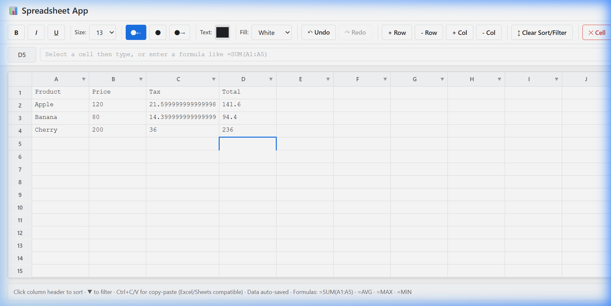
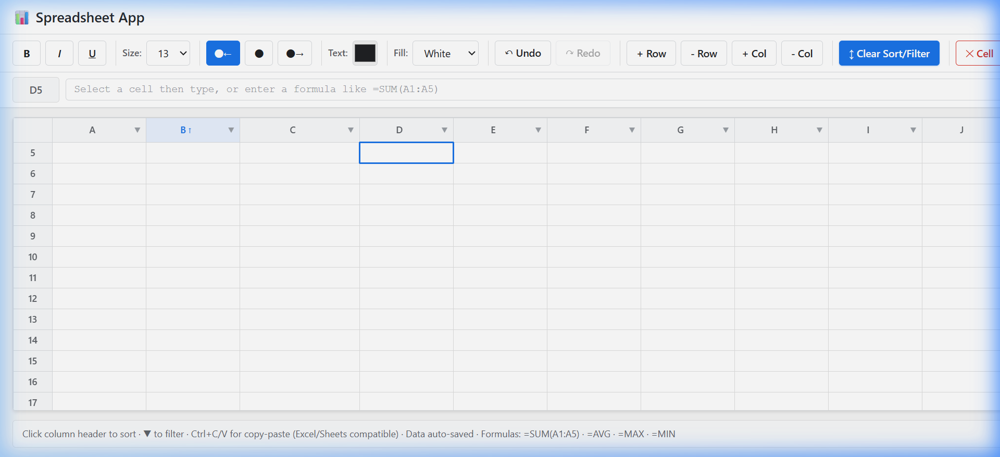
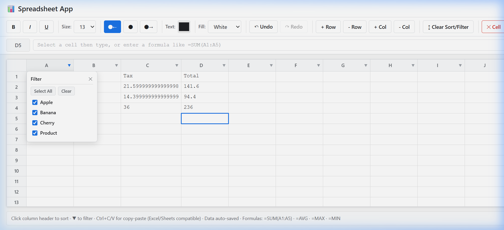
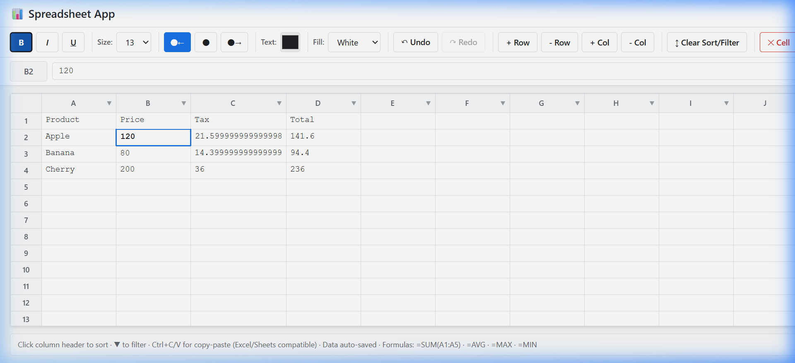

# 📊 AI-Native Spreadsheet App

>A fully-featured browser spreadsheet built with React + Vite, implementing column sort/filter, Excel-compatible clipboard, and localStorage persistence from scratch — no third-party spreadsheet library used.

---

## ✨ Live Demo

```bash
npm install
npm run dev        # → http://localhost:5173
```

---

## 📸 Screenshots

### Full Feature View — Formulas, Sorting, Formatting


### Task 1 — Column Sort (ascending ↑ active on column B)


### Task 1 — Excel-style Filter Dropdown


### Cell Formatting — Bold, Italic, Underline, Color, Alignment


---

## 🗂️ Project Structure

```
src/
├── engine/
│   └── core.js       # Pure JS formula engine (no React dependency)
├── App.jsx           # React UI — sort, filter, clipboard, persistence
├── App.css           # All styles
└── main.jsx          # Entry point
```

The engine is completely decoupled from React. It handles tokenizing, parsing, evaluating formulas, managing the dependency graph, and maintaining undo/redo history as a standalone JS module.

---

## 🔑 Key Technical Decisions

### Task 1 — Column Sort & Filter

**View-layer-only sort** — Sorting never mutates the engine's cell data. Instead, a `visibleRows` index array is computed with `useMemo` and used only during rendering. This means:
- Formulas always reference their true cell coordinates (A1, B2, etc.) regardless of display order
- Resetting sort is O(1) — just stop filtering the index array
- No data duplication or copying

**Sort on computed values** — During sort comparison, `engine.getCell()` returns the evaluated formula result (`21.6`), not the raw string (`=B2*0.18`). This matches Excel's behaviour.

**Filter cycle:** Each column tracks its allowed value set independently. Unchecking a value hides rows via index exclusion — rows are never deleted and formulas remain intact.

**Sort cycle:** Click column header label to cycle `none → ascending ↑ → descending ↓ → none`.

---

### Task 2 — Clipboard (Copy / Paste)

**External clipboard (Excel / Google Sheets):** Uses `navigator.clipboard.readText()`. Excel and Sheets both copy multi-cell data as tab-separated, newline-delimited text. This is split by `\n` (rows) then `\t` (columns) and written cell-by-cell starting at the selected anchor cell.

**Ctrl+C copies computed values:** The formula result is written to the system clipboard — not the raw formula string. This matches standard spreadsheet behaviour and allows pasting computed values into external apps.

**Undo support:** Every paste cell goes through `engine.setCell()`, which pushes entries onto the undo stack. `Ctrl+Z` reverses each cell change.

---

### Task 3 — localStorage Persistence

**Serialize raw formulas only** — `engine.serialize()` stores only the raw cell input (`=SUM(A1:A5)`), not computed values. On load, `engine.loadFromData()` re-evaluates all formulas fresh. This keeps storage small and avoids stale cached values.

**Debounced save (500ms)** — Every `version` or `cellStyles` state change schedules a save. React's `useEffect` cleanup cancels the previous timer, so rapid edits result in a single save.

**Load-before-save guard** — A `hasLoadedRef` flag prevents the auto-save from running before the initial localStorage load completes. Without this, the first render's save effect could overwrite persisted data with an empty grid.

**Corrupted data safety** — The load is wrapped in `try/catch`. If `JSON.parse` throws, the corrupted entry is removed with `localStorage.removeItem()` and the app starts fresh without crashing.

**Undo/redo intentionally not persisted** — Snapshot-based history can be megabytes. Restoring it across sessions would let users "undo" into states they never saw in the current session — confusing UX. Excluded by design.

---

### Formula Engine Design

The formula engine (`engine/core.js`) is a hand-written interpreter:

| Stage | Implementation |
|-------|---------------|
| **Tokenizer** | Regex-free character-by-character scan → tokens |
| **Parser** | Shunting-yard algorithm → AST |
| **Evaluator** | Recursive AST walk with visited-set cycle detection |
| **Dependency graph** | Bidirectional adjacency map for efficient recalculation |
| **Recalculation** | Topological sort of dirty cells; only affected cells recalculate |

---

## 🛡️ Edge Cases Handled

| Case | Behaviour |
|------|-----------|
| Circular formula (`=A1` in A1) | `#CYCLE!` — detected via DFS on dependency graph |
| Division by zero | `#VALUE!` error displayed in red |
| Invalid formula syntax | `#PARSE!` error |
| Sort on empty cells | Empty values sort last in both directions |
| Paste beyond grid bounds | Silently ignored (bounds-checked before write) |
| `localStorage` quota exceeded | `QuotaExceededError` caught, save skipped, no crash |
| Corrupted `localStorage` data | Cleared on startup, app starts fresh |
| Formula referencing deleted row/col | `#REF!` error |

---

## ⌨️ Keyboard Shortcuts

| Key | Action |
|-----|--------|
| `Enter` / `Tab` | Commit cell and move to next |
| `Arrow keys` | Navigate between cells |
| `Escape` | Cancel edit, restore original value |
| `Ctrl+C` | Copy selected cell's computed value |
| `Ctrl+V` | Paste from clipboard (supports Excel/Sheets multi-cell) |
| `Ctrl+Z` | Undo last action |
| `Ctrl+Y` | Redo |

---

## 🚀 Getting Started

**Requirements:** Node.js 18+, npm

```bash
# Clone and install
git clone <your-repo-url>
cd task_AI_native_Office_intern
npm install

# Run dev server
npm run dev     # http://localhost:5173

# Production build
npm run build
```

---

## 🛠️ Tech Stack

| Tool | Role |
|------|------|
| **React 18** | UI rendering, state management |
| **Vite** | Dev server, HMR, production bundler |
| **Vanilla CSS** | All styling — no UI library |
| **Web APIs** | `navigator.clipboard`, `localStorage` |
